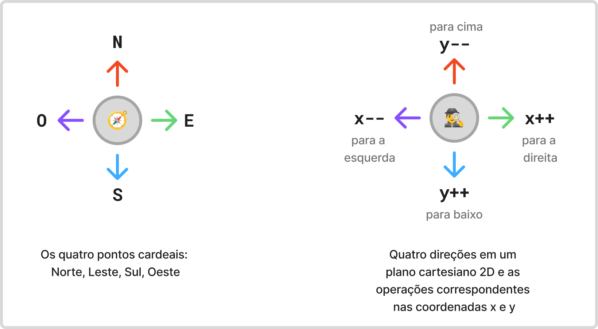

# Aleatoriedade

A aleatoriedade faz parte diversos processos computacionais e é um recurso chave para a representação ou criação de modelos de processos complexos da natureza, por exemplo.

A aleatoriedade poderia ser utilizada, por exemplo, para determinar a movimentação de um personagem de um jogo, utilizando quatro direções (norte, sul, leste, oeste) e escolhendo aleatoriamente a próxima direção.

As direções podem ser representadas no contexto das coordenadas cartesianas 2D da computação gráfica, como ilustra a figura a seguir.



A figura indica que o movimento na direção Norte representa um decremento na coordenada y (`y--`), enquanto um movimento na direção Leste indica um incremento na coordenada x (`x++`).

A partir disso, e reunindo os conceitos, podemos utilizar a função [`random()`](https://p5js.org/reference/p5/random/) com o parâmetro $4$ para retornar um número aleatório entre $0$ e $4-1$ e utilizá-lo em um condicional para realizar operações nas coordenadas x e y para criar um desenho que simula uma caminhada aleatória.

<div class="example-player"
     data-example-path="{{ config.site_url }}/examples/synthesis/0-random-walker/index.html"
     data-example-title="Random Walker"
     data-p5-editor="https://editor.p5js.org/jacksongomes/sketches/WahAyN1Zh">
</div>

Uma parte importante do sketch responsável por gerar esse comportamento é definida pela classe `Walker`.

```javascript
class Walker {
  constructor() {
    this.x = width / 2;
    this.y = height / 2;
  }

  show() {
    stroke(0);
    point(this.x, this.y);
  }

  step() {
    const choice = floor(random(4));
    if (choice == 0) {
      this.x++;
    } else if (choice == 1) {
      this.x--;
    } else if (choice == 2) {
      this.y++;
    } else {
      this.y--;
    }
  }
}
```

Três partes importantes deste código envolvem:

1. método `constructor()`: começa a desenhar a partir do centro do canvas;
2. método `show()`: define a cor do desenho e desenha um ponto na coordenada (x,y) atual;
3. método `step()`: determina a direção aleatoriamente e transforma a coordenada x ou y correspondente.

Assim, é possível criar um objeto da classe `Walker` no sketch.

```javascript
let walker;

function setup() {
  createCanvas(640, 240);
  walker = new Walker();
  background(255);
}

function draw() {
  walker.step();
  walker.show();
}
```

As funções [`setup()`](https://p5js.org/reference/p5/setup/) e [`draw()`](https://p5js.org/reference/p5/draw/) são usadas, respectivamente, para:

1. `setup()`
    - inicializar o canvas (aqui com dimensão $640 \times 240$ pixels);
    - criar uma instância da classe `Walker`;
    - definir a cor de fundo do canvas (aqui, a cor branca);
2. `draw()`
    - chamar o método `step()` do objeto `walker` para determinar a próxima posição do ponto que vai ser desenhado; e
    - chamar o método `show()` do objeto `walker` para desenhar o ponto na nova posição.

O resultado disso pode gerar resultados bastante interessantes ou assustadores, até.

Perceba também que o comportamento aleatório determinado pela função `random()` é determinado por uma distribuição uniforme, ou seja, cada possível número (0 a 3) tem a mesma chance de ser escolhido.

!!! note

    Como você poderia criar uma variação deste sketch para que a caminhada não fosse totalmente aleatória, mas um pouco enviesada para uma determinada direção?

## Ruído de Perlin

Os geradores de números aleatórios têm a característica de gerar números bastante distintos entre uma geração e a próxima. Embora isso possa ser desejável em várias situações, a simulação de comportamentos mais orgânicos e de fenômenos naturais poderiam se beneficiar de uma certa suavidade ou com um menor nível de distinção entre os números gerados em sequência.

Uma forma de fazer isso é utilizar o [**ruído de Perlin**](https://en.wikipedia.org/wiki/Perlin_noise), um método para geração de ruídos criado por [Ken Perlin](https://cs.nyu.edu/~perlin/) na década de 1990.

!!! note

    Curiosamente, o trabalho de Ken Perlin, aplicado à area do entretenimento, gerou uma contribuição significativa na área de efeitos especiais, principalmente por causa da **geração procedural**. 

    Quer ver um pouco mais sobre isso? Assista a ["O algoritmo que ganhou um Oscar!"](https://www.youtube.com/watch?v=V2ExdhfEOEI).

    Se quiser entender mais da matemática e dos conceitos fundamentais de forma detalhada, recomendo a leitura do artigo original: 

    Perlin, K. (1985). An image synthesizer. ACM SIGGRAPH Computer Graphics, 19(3), 287–296. https://doi.org/10.1145/325165.325247

    Acompanhe também a ótima explicação do Raouf Touti no post ["Perlin Noise: A Procedural Generation Algorithm"](https://rtouti.github.io/graphics/perlin-noise-algorithm).


Para ilustrar essa característica, considere os exemplos a seguir.

<div class="grid" markdown>

<div class="example-player"
     data-example-title="Surface random"
     data-example-path="{{ config.site_url }}/examples/synthesis/1-surface-random"
     data-p5-editor="https://editor.p5js.org/natureofcode/sketches/O7PsvcpQ3">
</div>

<div class="example-player"
     data-example-title="Surface noise"
     data-example-path="{{ config.site_url }}/examples/synthesis/2-surface-noise"
     data-p5-editor="https://editor.p5js.org/natureofcode/sketches/UGJqLCZb_">
</div>

</div>

O sketch da esquerda utiliza a função `random()`, enquanto o da direita utiliza a função [`noise()`](https://p5js.org/reference/p5/noise/). Perceba que há uma grande diferença na forma como os valores aleatórios são utilizados para gerar a silhueta de uma espécie de superfície montanhosa.

## Melhorando o Walker

Na demonstração a seguir, o random walker da esquerda está utilizando a função `random()`, enquanto o da direita utiliza a função `noise()`.

<div class="grid" markdown>

<div class="example-player"
     data-example-title="Walker random"
     data-example-path="{{ config.site_url }}/examples/synthesis/3-walker-random"
     data-p5-editor="https://editor.p5js.org/jacksongomes/sketches/C6E72bUrH">
</div>

<div class="example-player"
     data-example-title="Walker random"
     data-example-path="{{ config.site_url }}/examples/synthesis/4-walker-noise"
     data-p5-editor="https://editor.p5js.org/jacksongomes/sketches/AzlhNz7gO">
</div>

</div>

O código do sketch a seguir ilustra a utilização da função `noise()`.

```javascript
var d = 24;
var inc = 0.01;
var off1 = 0;
var off2 = 10000;

function setup() {
  createCanvas(400, 240);
}

function draw() {
  background(255);
  fill(55);

  var x = map(noise(off1), 0, 1, 0, width);
  var y = map(noise(off2), 0, 1, 0, height);

  off1 += inc;
  off2 += inc;

  ellipse(x, y, d, d);

}
```

A função `noise()` retorna o mesmo valor para o mesmo parâmetro, o que significa que precisamos passar um parâmetro que tenha algum incremento e, por isso, o código utiliza variável `inc` para determinar o incremento e as variáveis `off1` e `off2` para serem alteradas a cada instante.

A função `map()` é utilizada para garantir que os novos valores de coordenadas do centro da elipse estejam entre 0 e width e entre 0 e height, respectivamente.

## Ruído de Perlin em 2D e 3D

A chamada da função `noise()` com um parâmetro calcula um valor em 1D, mas com dois parâmetros, calcula um valor em 2D. Os parâmetros podem indicar espaço (com coordenadas (x,y)) ou espaço e tempo (com coordenadas (x,t), por exemplo).

Os sketches a seguir demonstram a simulação de um ruído em duas dimensões. O sketch da esquerda se assemelha ao ruído de uma TV (daquelas mais antigas) quando ocorria ausência ou diminuição significativa do sinal de transmissão do canal sintonizado.

<div class="grid" markdown>

<div class="example-player"
     data-example-title="Walker random"
     data-example-path="{{ config.site_url }}/examples/synthesis/5-tv-random"
     data-p5-editor="https://editor.p5js.org/jacksongomes/sketches/fc3CuxeHM"
     >
</div>

<div class="example-player"
     data-example-title="Walker random"
     data-example-path="{{ config.site_url }}/examples/synthesis/6-tv-noise"
     data-p5-editor="https://editor.p5js.org/jacksongomes/sketches/s2FYUuyoe"
     >
</div>

</div>

Para fazer o sketch da esquerda utilizamos a função `random()` mas também, neste caso, estamos manipulando os pixels do canvas, então é necessário um tratamento diferenciado, utilizando a função `set()` para determinar o valor do pixel nas coordenadas `(x,y)`.

```javascript
function draw() {
  loadPixels();
  for (let x = 0; x < width; x++) {
    for (let y = 0; y < height; y++) {
      let bright = random(255);
      set(x, y, bright);
    }
  }
  updatePixels();
  noLoop();
}

```

Já o sketch da direita utiliza a função `noise()` para duas dimensões. 

```javascript
function draw() {
  loadPixels();

  var xoff = 0.0;
  for (let x = 0; x < width; x++) {
    var yoff = 0.0;
    for (let y = 0; y < height; y++) {
      let bright = map(noise(xoff, yoff), 0, 1, 0, 255);
      set(x, y, bright);
      yoff += inc;
    }
    xoff += inc;
  }

  updatePixels();

}
```

De fato, há mais uma forma de utilizar a função `noise()`, que é passando três parâmetros. Nesse caso, isso é utilizado para representar coordenadas espaciais (x,y,z) ou espaciais em 2D mais o tempo (x,y,t).

O resultado é o sketch a seguir, que cria uma espécie de simulação de céu nublado em movimento.

<div class="example-player"
     data-example-title="Walker random"
     data-example-path="{{ config.site_url }}/examples/synthesis/7-tv-noise-time"
     data-p5-editor="https://editor.p5js.org/jacksongomes/sketches/hYCo480ME"
     >
</div>

