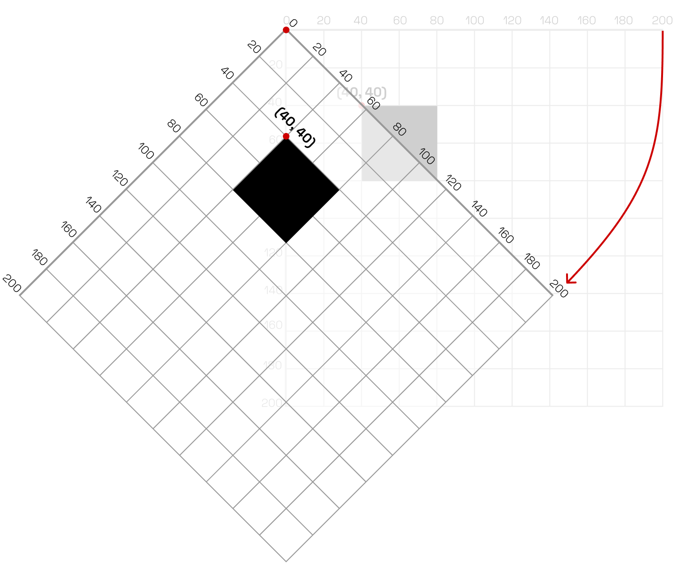
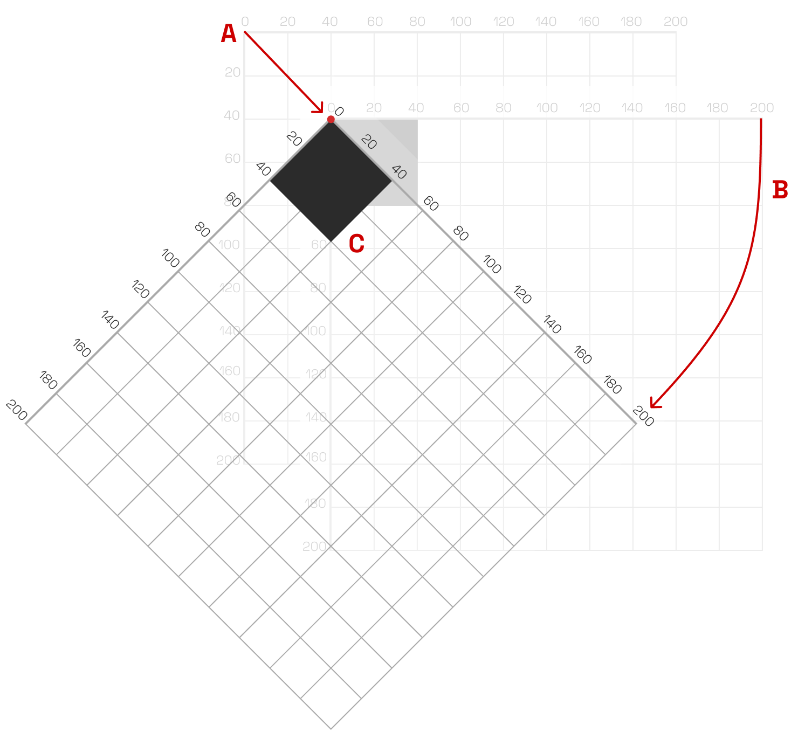

# Rotação

A rotação é uma transformação que gira um objeto em torno de um ponto fixo, conhecido como centro de rotação. Em termos de vetores, a rotação de um ponto \( P(x, y) \) **em torno da origem** por um ângulo \( \theta \) resulta em um novo ponto \( P'(x', y') \), onde:

\[
\begin{align*}
x' &= x \cdot \cos(\theta) - y \cdot \sin(\theta) \\
y' &= x \cdot \sin(\theta) + y \cdot \cos(\theta)
\end{align*}
\]

ou

$$
\begin{align}
P' = R(\theta) \cdot P
\end{align}
$$  

onde \( R(\theta) \) é a matriz de rotação:

\[
R(\theta) = \begin{bmatrix}
\cos(\theta) & -\sin(\theta) \\
\sin(\theta) & \cos(\theta)
\end{bmatrix}
\]  

A matriz de rotação também pode ser representada utilizando a matriz homogênea 3x3:

\[
R(\theta) = \begin{bmatrix}
\cos(\theta) & -\sin(\theta) & 0 \\
\sin(\theta) & \cos(\theta) & 0 \\
0 & 0 & 1
\end{bmatrix}
\]

Considere a figura a seguir, que desenha um retângulo e depois o gira em torno da origem do sistema de coordenadas.

<figure markdown="span">
     {width="600"}
     <figcaption>Figura: Ilustração da rotação de um objeto no espaço 2D</figcaption>
</figure>

Podemos afirmar que o retângulo foi rotacionado por um ângulo \( \theta = 45^\circ \) (ou \( \frac{\pi}{4} \) radianos). Note que a rotação altera a orientação do retângulo em relação à sua posição original. Uma questão com a rotação é o ponto em torno do qual o objeto gira. No exemplo acima, o retângulo gira em torno da origem `(0,0)`, o que pode não ser o comportamento desejado. Para girar o retângulo em torno de seu canto superior direito &mdash; que está em `(40, 40)` &mdash; precisamos seguir os passos:

1. transladar o sistema de coordenadas para o ponto `(40, 40)`;
2. aplicar a rotação;
3. desenhar o retângulo na posição `(0, 0)`.


<figure markdown="span">
     {width="600"}
     <figcaption>Figura: Ilustração da rotação de um objeto no espaço 2D alterando a origem do sistema de coordenadas</figcaption>
</figure>


Em p5.js, podemos aplicar uma rotação usando a função `rotate(angle)` entre `push()` e `pop()`, como no exemplo a seguir. Importante lembrar que `angle` deve estar em radianos. Para converter graus em radianos, podemos usar a função `radians(degrees)`.

```javascript
function setup() {
  createCanvas(400, 400);
}

function draw() {
  background(255);
  push();
  translate(width / 2, height / 2);
  rotate(PI / 4);
  rectMode(CENTER);
  rect(0, 0, 100, 100);
  pop();
}
```

Neste exemplo, o retângulo é desenhado no centro do canvas e rotacionado em \( 45^\circ \). A função `push()` salva o estado atual do sistema de coordenadas, e a função `pop()` restaura o estado salvo, garantindo que a rotação não afete outras partes do desenho.


<div class="sketch-runner"
     data-sketch-path="../demo-rotation.js"
     data-width="400"
     data-height="400"
     data-title="Grupo de casas com rotação"
     data-pause-at-beginning="false">
</div>

A função `rectMode(CENTER)` é usada para desenhar o retângulo a partir do seu centro, facilitando a visualização da rotação em torno do ponto central.