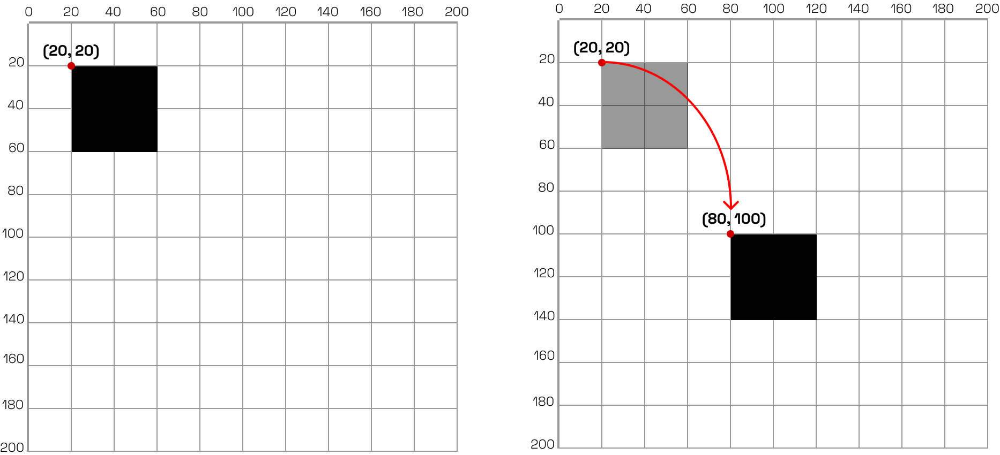
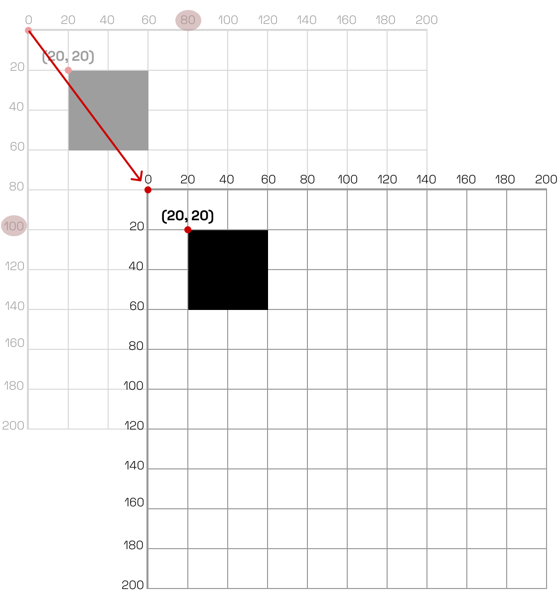

# Translação

O canvas é como um papel gráfico ou um plano de coordenadas. A origem `(0,0)` está no canto superior esquerdo e os valores de `x` crescem para a direita e os valores de `y` crescem para baixo.

A translação é uma transformação que move um objeto de um lugar para outro no espaço 2D. Em termos de vetores, a translação de um ponto \( P(x, y) \) por um vetor \( \vec{t}(t_x, t_y) \) resulta em um novo ponto \( P'(x', y') \), onde:

\[
\begin{align*}
x' &= x + t_x \\
y' &= y + t_y
\end{align*}
\]

ou

$$
\begin{align}
P' = P + \vec{t}
\end{align}
$$

A matriz de translação não é representada como uma matriz 2x2, como as outras transformações, mas sim como uma matriz 3x3 em coordenadas homogêneas:

\[
T = \begin{bmatrix}
1 & 0 & t_x \\
0 & 1 & t_y \\
0 & 0 & 1
\end{bmatrix}
\]

Assim, o ponto \( P \) em coordenadas homogêneas é representado como:

\[
P = \begin{bmatrix}
x \\
y \\
1
\end{bmatrix}
\]

E a translação pode ser expressa como:

\[
P' = T \cdot P
\]

Na prática, a translação é usada para alterar as coordenadas de um objeto, movendo-o para uma nova posição no canvas. Considere a figura a seguir, que desenha um retângulo na posição `(20, 20)` e depois o move para `(80, 100)`.


<figure markdown="span">
     {width="800"}
     <figcaption>Figura: Ilustração da movimentação de um objeto no espaço 2D</figcaption>
</figure>


Podemos afirmar que o retângulo foi transladado pelo vetor \( \vec{t}(60, 80) \), pois:

\[
\begin{align*}
x' &= 20 + 60 = 80 \\
y' &= 20 + 80 = 100
\end{align*}
\]

Entretanto, há uma forma mais adequada de fazer isso: **mover o sistema de coordenadas**. Se você **mover o sistema de coordenadas** para `(60, 80)`, então **desenhar o retângulo na mesma posição** `(20, 20)`.


<figure markdown="span">
     {width="500"}
     <figcaption>Figura: Ilustração da translação do sistema de coordenadas</figcaption>
</figure>


Perceba que eu disse: **mover o sistema de coordenadas**, não mover o retângulo. Aqui está uma diferença fundamental. Tente não se esquecer disso. Além disso, como a figura ilustra, a translação altera a origem do sistema de coordenadas em relação à origem anterior, ou seja, é como se houvessem duas camadas, uma sobre a outra: a camada original e a camada transladada. Assim, cada operação sobre o sistema de coordenadas, gera uma nova camada (no topo) em relação à camada anterior.

Por este motivo, transladar o sistema de coordenadas para `(60, 80)` considera a camada original, ou seja, a nova origem `(0,0)` está na posição `(60, 80)` da camada original. Portanto, desenhar o retângulo na posição `(20, 20)` da camada transladada, resulta no mesmo efeito visual de desenhá-lo na posição `(80, 100)` da camada original.

Em p5.js, podemos aplicar uma translação usando a função `translate(tx, ty)` entre `push()` e `pop()`, como no exemplo a seguir.

```javascript
function setup() {
  createCanvas(400, 400);
}

function draw() {
  background(255);

  push();
  translate(60, 80);
  rect(20, 20, 40, 40);
  pop();
}
```

Neste exemplo, o retângulo é desenhado na nova origem `(80, 100)`. A função `push()` salva o estado atual do sistema de coordenadas, e a função `pop()` restaura o estado salvo, garantindo que a translação não afete outras partes do desenho.


## Qual a vantagem disso?

Imagine criar um sketch que desenha um grupo de casas. O desenho de uma casa considera três objetos: um retângulo (a casa), um triângulo (o telhado) e um retângulo menor (a porta). O código para desenhar uma casa na posição `(0, 0)` poderia ser algo assim:

```javascript
// Desenha a casa
triangle(15, 0, 0, 15, 30, 15); // Corpo
rect(0, 15, 30, 30); // Telhado
rect(12, 30, 10, 15); // Porta
```

O desafio é desenhar várias casas em diferentes posições, ajustadas manualmente.

Uma solução mais viável é usar a translação para mover o sistema de coordenadas para a posição desejada antes de desenhar cada casa. O sketch a seguir ilustra essa abordagem, desenhando um grupo de casas em diferentes posições.


<div class="sketch-runner"
     data-sketch-path="../demo-translate-house.js"
     data-width="600"
     data-height="200"
     data-title="Grupo de casas com translação"
     data-pause-at-beginning="false">
</div>

O sketch define a classe `House`, que possui um método `display()` responsável por desenhar a casa na posição `(0, 0)`. 

```javascript
class House {
    constructor(x, y) {
        this.x = x;
        this.y = y;
    }

    display() {
        push();
        translate(this.x, this.y);
        // Desenha a casa
        pop();
    }
}
```

O restante do sketch, principalmente na função `setup()`, cria várias instâncias da classe `House` em diferentes posições  e as armazena em um array.  As posições são definidas com base em um passo fixo (`HOUSE_STEP`), garantindo que as casas fiquem espaçadas uniformemente.


```javascript
let houses = [];
const HOUSE_STEP = 70;

function setup() {
    createCanvas(600, 200);
    const houseY = height / 2 - 30;

    for (let i = 50; i < width; i += HOUSE_STEP) {
        houses.push(new House(i, houseY));
    }

}
```

Por fim, na função `draw()`, o método `display()` de cada casa é chamado para desenhá-las na tela.

```javascript
function draw() {
    background(255);

    houses.forEach((house, index) => {
        house.display();
    });
}
```

Portanto, a importância da translação se torna evidente quando consideramos a criação de múltiplas instâncias de objetos que compartilham uma lógica de desenho semelhante, mas precisam ser posicionados em locais diferentes na tela. Isso não apenas simplifica o código, mas também o torna mais modular e fácil de entender.