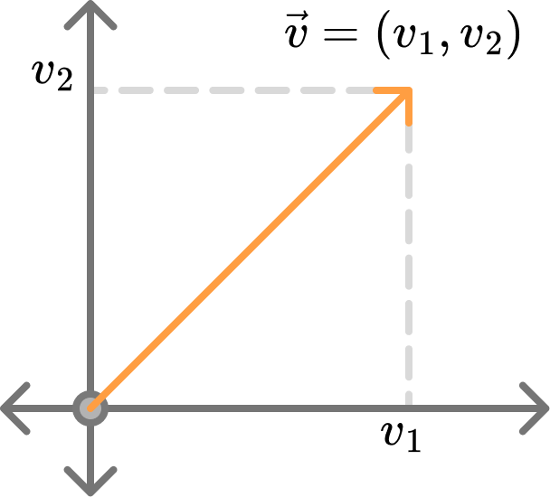
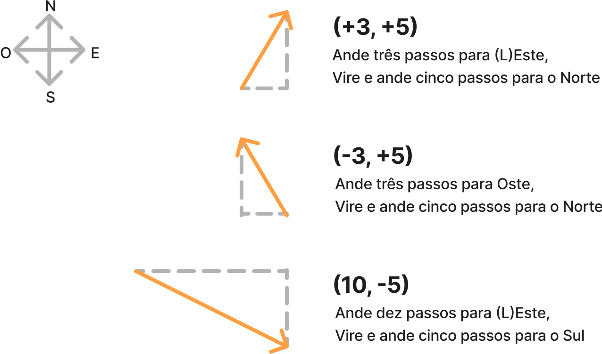
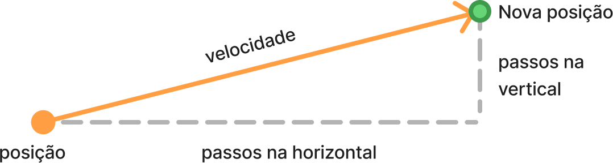
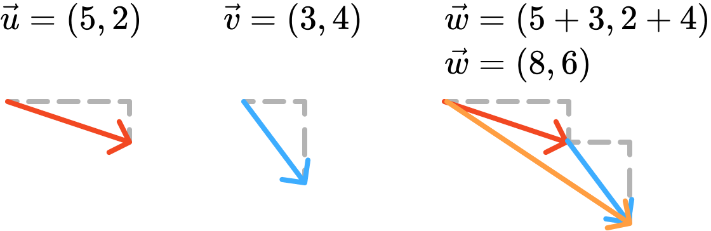
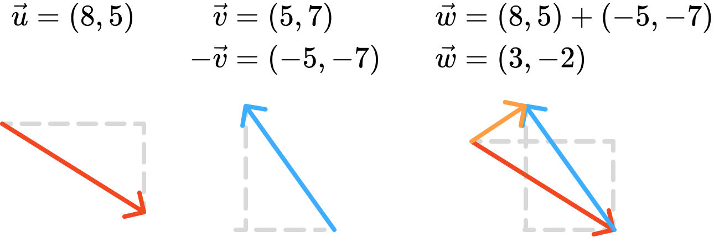

# Vetores

**Vetores** são fundamentais em simulações e computação gráfica, pois representam grandezas físicas que possuem **magnitude** (tamanho) e **direção**. Exemplos clássicos incluem o movimento de uma esfera caindo, o giro de um planeta ao redor do sol, ou a direção de uma força. Diferentemente de **escalares** (como massa ou temperatura, que têm apenas valor), vetores descrevem deslocamentos, velocidades, forças e muitas outras grandezas essenciais para modelar o mundo físico.

Por exemplo, dizer que um carro se move a 60 km/h é uma informação incompleta (escalar). Dizer que se move a 60 km/h para nordeste é uma informação completa (vetorial).

## Aplicações em Computação Gráfica

Vetores são usados para:

- Descrever posições, velocidades e acelerações
- Calcular direções de luz e normais de superfícies
- Detectar colisões e calcular rebotes
- Definir direções de câmeras e objetos em 3D

## Exemplo: Bola quicando (sem vetores)

Antes de nos aprofundarmos no entendimento dos vetores e suas aplicações em computação gráfica, veja primeiro o sketch que implementa a simulação da bola quicando dentro da caixa utilizando variáveis separadas para cada coordenada de posição e velocidade (sem vetores).

<div class="sketch-runner"
     data-sketch-path="./demo-ball-bouncing-without-vectors.js"
     data-width="400"
     data-height="400"
     data-title="Bola quicando (sem vetores)"
     data-pause-at-beginning="false">
</div>

O sketch adota duas variáveis para a posição (`cx` e `cy`) e duas para a velocidade (`vx` e `vy`). 

```javascript title="Bola quicando (sem vetores): variáveis para posição e velocidade"
--8<-- "3-synthesis/vectors/demo-ball-bouncing-without-vectors.js:1:6"
```

A cada frame, a posição é atualizada somando a velocidade, e quando a bola atinge uma borda, o sinal da velocidade correspondente é invertido para simular o rebote.

```javascript title="Bola quicando (sem vetores): atualização da posição e detecção de colisão"
--8<-- "3-synthesis/vectors/demo-ball-bouncing-without-vectors.js:12:31"
```

Quando ocorre colisão, invertemos o sinal da velocidade na direção correspondente. Em 3D, seriam necessárias três variáveis para cada propriedade, uma para cada coordenada (x, y, z).


## Conceito e Representação

O **vetor Euclidiano** (ou **vetor geométrico**) é o tipo de vetor que utilizamos neste material. Ele é representado matematicamente por suas componentes em cada dimensão do espaço. Em 2D, escrevemos $\vec{v} = (v_1, v_2)$ ou, associando diretamente às coordenadas, $\vec{v} = (v_x, v_y)$. Em 3D, teríamos $\vec{v} = (v_1, v_2, v_3)$ ou $\vec{v} = (v_x, v_y, v_z)$. A notação alternativa $\mathbf{v}$ também é comum.

De forma geral, o vetor é representado matematicamente como:

$$
\begin{align}
  \vec{v} = (v_1, v_2, \ldots, v_n)
\end{align}
$$

onde $n$ é a dimensão do espaço (2D, 3D, etc.) e $v_i$ são as componentes do vetor.

Um vetor pode ser visualizado como uma **seta**: a direção indica para onde aponta, e a magnitude (ou **norma**) é o comprimento da seta. Frequentemente, dizemos que um vetor parte de um ponto $A$ e chega a um ponto $B$, mas em computação gráfica, normalmente consideramos vetores a partir da origem.

<figure markdown="span">
     {width="300"}
     <figcaption>Representação visual de um vetor Euclidiano mostrando magnitude (comprimento da seta) e direção (orientação da seta)</figcaption>
</figure>

Pense em um vetor como instruções para caminhar de um ponto a outro:  

- `(3, 5)`: caminhe 3 unidades para o leste e 5 para o norte.  
- `(-3, 5)`: caminhe 3 para o oeste e 5 para o norte.  
- `(10, -5)`: caminhe 10 para o leste e 5 para o sul.

<figure markdown="span">
     {width="500"}
     <figcaption>Analogia de vetores como instruções de caminhada: cada vetor indica direção e distância a percorrer no plano cartesiano</figcaption>
</figure>

A **magnitude** (ou norma) de um vetor é calculada pelo Teorema de Pitágoras:

**Para 2D:**

$$
\begin{align}
  \Vert\vec{v}\Vert = \sqrt{v_1^2 + v_2^2}
\end{align}
$$

**Para 3D:**

$$
\begin{align}
  \Vert\vec{v}\Vert = \sqrt{v_1^2 + v_2^2 + v_3^2}
\end{align}
$$

**Para n dimensões:**

$$
\begin{align}
  \Vert\vec{v}\Vert = \sqrt{\sum_{i=1}^{n} v_i^2}
\end{align}
$$

A figura a seguir ilustra a relação entre o cálculo da norma e o Teorema de Pitágoras (cálculo da hipotenusa do triângulo retângulo).

<figure markdown="span">
     {width="330"}
     <figcaption>Cálculo da norma (magnitude) do vetor usando o Teorema de Pitágoras - a hipotenusa do triângulo retângulo formado pelas componentes</figcaption>
</figure>


## Vetores em p5.js

Na biblioteca p5.js, a classe `p5.Vector` e a função `createVector(x, y)` facilitam a criação e manipulação de vetores:

```javascript
let position = createVector(100, 100);
let velocity = createVector(1, 3.3);
```

A seguir, um exemplo de implementação do sketch da bola quicando dentro de uma caixa, utilizando vetores para representar a posição e a velocidade da bola.

### Exemplo: Bola quicando (com vetores)

Ao usar vetores, agrupamos as propriedades relacionadas:

```javascript
let position = createVector(100, 100);
let velocity = createVector(2, 3);
```

A atualização da posição é feita somando o vetor de velocidade ao vetor de posição:

```javascript
position.add(velocity);
```

A figura a seguir ilustra a relação entre o vetor posição (localização atual) e o vetor velocidade (direção e velocidade do movimento).

<figure markdown="span">
     {width="500"}
     <figcaption>Relação entre vetor posição (localização atual) e vetor velocidade (direção e velocidade do movimento)</figcaption>
</figure>

A figura indica que o vetor "posição", ao ser atualizado pela soma com o vetor "velocidade", resulta em um novo vetor posição, deslocado na direção e magnitude da velocidade (na prática, movendo-se x passos na horizontal e y passos na vertical).

No sketch, a cada frame, a posição é atualizada pela velocidade, representando o movimento do objeto.

!!! note "Terminologia"

    Utilizamos "velocity" (velocidade) para nos referir ao vetor que representa tanto a direção quanto a velocidade do movimento. Em alguns contextos, "velocity" refere-se apenas à magnitude da velocidade.

Na sequência, veremos mais detalhes sobre as operações que podem ser realizadas com vetores.

## Operações com Vetores

### Adição

A soma de dois vetores resulta em um novo vetor, somando-se componente a componente:

$$
\begin{align}
  \vec{w} = \vec{u} + \vec{v} = (u_1 + v_1,\, u_2 + v_2)
\end{align}
$$

Exemplo:

- $\vec{u} = (5, 2)$
- $\vec{v} = (3, 4)$
- $\vec{w} = (5, 2) + (3, 4) = (8, 6)$


<figure markdown="span">
     {width="500"}
     <figcaption>Adição de vetores usando a regra do paralelogramo - o vetor resultante é a diagonal que conecta a origem ao vértice oposto</figcaption>
</figure>

### Subtração

A subtração de vetores é feita componente a componente:

$$
\begin{align}
  \vec{w} = \vec{u} - \vec{v} = (u_1 - v_1,\, u_2 - v_2)
\end{align}
$$

Ou, de forma equivalente, somando o vetor negativo:

$$
\begin{align}
  \vec{w} = \vec{u} + (-\vec{v})
\end{align}
$$

Quando temos dois vetores $\vec{u}$ e
$\vec{v}$, a subtração vetorial $\vec{v} - \vec{u}$
produz um vetor que aponta de $\vec{u}$ para
$\vec{v}$ (**perceba a ordem na subtração**). A magnitude (ou norma) deste vetor de
diferença é exatamente a distância euclidiana entre
os dois pontos.

<figure markdown="span">
     {width="500"}
     <figcaption>Subtração de vetores: o resultado aponta do extremo do segundo vetor para o extremo do primeiro, indicando a diferença entre eles</figcaption>
</figure>

O skecth a seguir ilustra este conceito.

<div class="sketch-runner"
     data-sketch-path="./demo-vector-subtraction-scheme.js"
     data-width="700"
     data-height="500"
     data-title="Diferença entre Vetores"
     data-pause-at-beginning="false">
</div>


Em p5.js podemos calcular a diferença entre dois vetores usando o método `sub()` ou a função estática `p5.Vector.sub()`:

```javascript
let difference = p5.Vector.sub(v, u);
```

O vetor `difference` resultante aponta de $\vec{u}$ para $\vec{v}$.

**Interpretação Geométrica**

O vetor diferença $\vec{v} - \vec{u}$ representa:

1. **Direção**: De $\vec{u}$ para $\vec{v}$
2. **Sentido**: Apontando para $\vec{v}$
3. **Magnitude**: A distância euclidiana entre $\vec{u}$ e $\vec{v}$

Veja o sketch a seguir, onde uma bola aponta na direção do mouse. O vetor diferença entre o vetor do mouse e o vetor da bola é calculado para determinar o vetor direção ($\vec{mouse} - \vec{ball}$).

<div class="sketch-runner"
     data-sketch-path="./demo-vector-subtraction-ball-static-mouse.js"
     data-width="400"
     data-height="400"
     data-title="Diferença entre Vetores"
     data-pause-at-beginning="false">
</div>

### Multiplicação por Escalar

Multiplicar um vetor por um número real (escalar) altera sua magnitude, mantendo a direção:

$$
\begin{align}
  a \cdot \vec{v} = (a \cdot v_1,\, a \cdot v_2)
\end{align}
$$

A magnitude do vetor resultante é:

$$
\Vert a \cdot \vec{v} \Vert = |a| \cdot \Vert \vec{v} \Vert
$$

De outra forma, a multiplicação por escalar estica ou encolhe o vetor:

- Se $|a| > 1$, o vetor é esticado (aumenta a magnitude)
- Se $0 < |a| < 1$, o vetor é encolhido (diminui a magnitude)
- Se $a < 0$, o vetor é invertido (aponta na direção oposta)

Em p5.js podemos multiplicar um vetor por um escalar usando o método `mult()`:

```javascript
velocity.mult(2); // dobra a velocidade
```

### Normalização

Um **vetor unitário** tem magnitude igual a 1. Para normalizar um vetor $\vec{v}$ (ou seja, convertê-lo em um vetor unitário), dividimos cada componente pela magnitude do vetor:

$$
\begin{align}
  \vec{u} = \frac{\vec{v}}{\Vert\vec{v}\Vert}
\end{align}
$$

!!! note "Normalização"

    A normalização é útil para garantir que um vetor tenha magnitude 1, mantendo sua direção. Isso é especialmente importante em computação gráfica e física, onde vetores unitários são frequentemente usados para representar direções.


Em p5.js podemos normalizar um vetor usando o método `normalize()`:

```javascript
velocity.normalize();
```

### Produto Escalar (*Dot Product*)

O **produto escalar** é uma das operações mais úteis e versáteis com vetores. Ele mede o quanto dois vetores apontam na mesma direção e tem múltiplas interpretações geométricas.

**Fórmula matemática**

$$
\begin{align}
  \vec{a} \cdot \vec{b} = a_1 b_1 + a_2 b_2
\end{align}
$$

**Interpretação geométrica**

$$
\begin{align}
  \vec{a} \cdot \vec{b} = \Vert\vec{a}\Vert \Vert\vec{b}\Vert \cos(\theta)
\end{align}
$$

onde $\theta$ é o ângulo entre os vetores.

**Interpretações práticas**

1. **Direção relativa**:
    1. Se $\vec{a} \cdot \vec{b} > 0$: vetores apontam na mesma direção geral (ângulo < 90°)
    2. Se $\vec{a} \cdot \vec{b} = 0$: vetores são perpendiculares (ângulo = 90°)
    3. Se $\vec{a} \cdot \vec{b} < 0$: vetores apontam em direções opostas (ângulo > 90°)

2. **Projeção**: O produto escalar de $\vec{a}$ com um vetor unitário $\hat{u}$ dá a magnitude da projeção de $\vec{a}$ na direção de $\hat{u}$, ou seja: $\text{projeção} = \vec{a} \cdot \hat{u}$

3. **Similaridade**: Vetores normalizados com produto escalar próximo de $1$ são muito similares; próximo de $-1$ são opostos.

Em p5.js podemos calcular o produto escalar usando o método `dot()` ou a função estática `p5.Vector.dot()`:

```javascript
let a = createVector(3, 4);
let b = createVector(2, 1);
let dot = p5.Vector.dot(a, b);

// Interpretação do resultado
if (dot > 0) {
  console.log("Vetores apontam na mesma direção geral");
} else if (dot < 0) {
  console.log("Vetores apontam em direções opostas");
} else {
  console.log("Vetores são perpendiculares");
}
```

**Casos práticos:**

- **Detecção de colisão**: Verificar se um objeto está se movendo em direção a outro
- **Iluminação**: Calcular intensidade da luz baseada no ângulo com a normal da superfície
- **Campo de visão**: Determinar se um objeto está dentro do cone de visão
- **Física**: Calcular trabalho realizado por uma força ($W = \vec{F} \cdot \vec{d}$)


### Produto Vetorial (*Cross Product*)

O **produto vetorial** é uma operação fundamental em 3D que produz um vetor perpendicular aos dois vetores originais. Diferente do produto escalar que resulta em um número, o produto vetorial gera um novo vetor.

**Fórmula matemática para 3D:**

$$
\begin{align}
\vec{a} \times \vec{b} = (a_2 b_3 - a_3 b_2, a_3 b_1 - a_1 b_3, a_1 b_2 - a_2 b_1)
\end{align}
$$

O produto vetorial entre dois vetores tridimensionais $\vec{a}$ e $\vec{b}$ resulta em um novo vetor $\vec{a} \times \vec{b}$ perpendicular ao plano formado por eles. A equação  mostra como calcular cada componente desse vetor resultante: o primeiro elemento corresponde à diferença entre o produto do segundo componente de $\vec{a}$ pelo terceiro de $\vec{b}$ e o produto do terceiro de $\vec{a}$ pelo segundo de $\vec{b}$, e assim por diante para os outros componentes.

!!! note "Determinante"

    O produto vetorial pode ser representado como o determinante de uma matriz 3x3:

    $$
    \vec{a} \times \vec{b} = \begin{vmatrix}
    \hat{i} & \hat{j} & \hat{k} \\
    a_1 & a_2 & a_3 \\
    b_1 & b_2 & b_3
    \end{vmatrix}
    $$

    onde $\hat{i}$, $\hat{j}$ e $\hat{k}$ são os vetores unitários nas direções x, y e z, respectivamente.

    Assim, o determinante fornece uma forma compacta e sistemática de calcular o vetor perpendicular aos dois vetores originais.

**Exemplo Numérico: Produto Vetorial**

Considere os vetores $\vec{a} = (2, 3, 4)$ e $\vec{b} = (5, 6, 7)$. Vamos calcular o produto vetorial $\vec{a} \times \vec{b}$ passo-a-passo:

Pela fórmula:

$$
\vec{a} \times \vec{b} = (a_2 b_3 - a_3 b_2,\;\; a_3 b_1 - a_1 b_3,\;\; a_1 b_2 - a_2 b_1)
$$

Substituindo os valores:

- Primeira componente (x): $3 \times 7 - 4 \times 6 = 21 - 24 = -3$
- Segunda componente (y): $4 \times 5 - 2 \times 7 = 20 - 14 = 6$
- Terceira componente (z): $2 \times 6 - 3 \times 5 = 12 - 15 = -3$

Portanto,

$$
\vec{a} \times \vec{b} = (-3,\; 6,\; -3)
$$

**Interpretação:**

- O vetor resultante é perpendicular aos vetores $\vec{a}$ e $\vec{b}$.
- Sua direção segue a regra da mão direita.
- Sua magnitude corresponde à área do paralelogramo formado por $\vec{a}$ e $\vec{b}$.


**Interpretação geométrica**:

$$
\begin{align}
\|\vec{a} \times \vec{b}\| = \|\vec{a}\| \|\vec{b}\| \sin(\theta)
\end{align}
$$

onde $\theta$ é o ângulo entre os vetores.

**Propriedades importantes**:

1. **Direção**: O vetor resultante é perpendicular aos dois vetores originais
2. **Magnitude**: Igual à área do paralelogramo formado pelos vetores
3. **Regra da mão direita**: Determina a direção do vetor resultante
4. **Anti-comutatividade**: $\vec{a} \times \vec{b} = -(\vec{b} \times \vec{a})$
5. **Vetor nulo**: Se $\vec{a} \parallel \vec{b}$, então $\vec{a} \times \vec{b} = \vec{0}$

Em p5.js podemos calcular o produto vetorial usando a função estática `p5.Vector.cross()`:

```javascript
let a = createVector(1, 2, 3);
let b = createVector(4, 5, 6);
let cross = p5.Vector.cross(a, b);

// Resultado: Vetor perpendicular aos vetores a e b
```

**Para vetores 2D (tratados como 3D com z=0):**

```javascript
let a = createVector(3, 4);  // Automaticamente (3, 4, 0)
let b = createVector(1, 2);  // Automaticamente (1, 2, 0)
let cross = p5.Vector.cross(a, b);

// Resultado: (0, 0, 2) - aponta para fora da tela (z=2)
```

**Casos práticos:**

1. **Cálculo de normais**: Determinar a normal de uma superfície a partir de dois vetores tangentes
2. **Rotação e orientação**: Verificar se uma rotação é horária ou anti-horária
3. **Área de triângulos/paralelogramos**: $\text{Área} = \frac{1}{2}\|\vec{a} \times \vec{b}\|$
4. **Torque em física**: $\vec{\tau} = \vec{r} \times \vec{F}$
5. **Detecção de lado**: Verificar de que lado de uma linha um ponto está

**Interpretação do resultado:**

- **Magnitude grande**: Vetores são quase perpendiculares
- **Magnitude pequena**: Vetores são quase paralelos
- **Magnitude zero**: Vetores são paralelos ou anti-paralelos
- **Direção**: Perpendicular ao plano formado pelos dois vetores

!!! warning "Limitação em 2D"
    Em 2D, o produto vetorial não existe geometricamente. Em p5.js, vetores 2D são tratados como 3D com z = 0, resultando em um vetor que aponta para dentro ou fora da tela.

!!! tip "Regra da Mão Direita"
    Para determinar a direção de $\vec{a} \times \vec{b}$: aponte os dedos da mão direita na direção de $\vec{a}$, curve-os em direção a $\vec{b}$, e o polegar indicará a direção do produto vetorial.


## Resumo das Operações

| Operação         | Fórmula                              | p5.js                      |
|------------------|--------------------------------------|----------------------------|
| Soma             | $\vec{u} + \vec{v}$                  | `u.add(v)`                 |
| Subtração        | $\vec{u} - \vec{v}$                  | `u.sub(v)`                 |
| Multiplicação    | $a \cdot \vec{v}$                    | `v.mult(a)`                |
| Normalização     | $\vec{v} / \Vert\vec{v}\Vert$        | `v.normalize()`            |
| Produto escalar  | $\vec{u} \cdot \vec{v}$              | `p5.Vector.dot(u, v)`      |
| Produto vetorial | $\vec{u} \times \vec{v}$ (3D)        | `p5.Vector.cross(u, v)`    |


## Ângulo entre Vetores

O ângulo entre dois vetores pode ser calculado usando o produto escalar:

$$
\begin{align}
  \cos(\theta) = \frac{\vec{a} \cdot \vec{b}}{\Vert\vec{a}\Vert \Vert\vec{b}\Vert}
\end{align}
$$

Portanto:

$$
\begin{align}
\theta = \arccos\left(\frac{\vec{a} \cdot \vec{b}}{\Vert\vec{a}\Vert \Vert\vec{b}\Vert}\right)
\end{align}
$$

Em p5.js:

```javascript
let angle = p5.Vector.angleBetween(a, b);
```

**Casos especiais:**

- Se $\theta = 0°$: vetores apontam na mesma direção
- Se $\theta = 90°$: vetores são perpendiculares
- Se $\theta = 180°$: vetores apontam em direções opostas

Podemos utilizar essa informação para, dentre outras aplicações:

- Determinar se um objeto está dentro do campo de visão
- Calcular reflexões e refrações
- Ajustar orientações de câmeras e luzes


## Métodos Estáticos vs. Métodos de Instância

Em p5.js, há duas formas de trabalhar com vetores:

### Métodos de Instância (modificam o vetor original)
```javascript
let v = createVector(3, 4);
v.add(createVector(1, 2)); // v agora é (4, 6)
v.mult(2); // v agora é (8, 12)
```

### Métodos Estáticos (criam novos vetores)
```javascript
let a = createVector(3, 4);
let b = createVector(1, 2);
let result = p5.Vector.add(a, b); // a e b não são modificados
```

**Quando usar cada um:**

- **Métodos de instância**: quando você quer modificar o vetor original (ex: atualizar posição)
- **Métodos estáticos**: quando você quer preservar os vetores originais (ex: cálculos temporários)


Os sketches a seguir ilustram a utilização dos recursos vistos neste capítulo.


<div class="grid" markdown>

<div class="sketch-runner"
     data-sketch-path="./demo-vector-ball-chasing-mouse.js"
     data-width="400"
     data-height="400"
     data-title="Bola perseguindo o mouse (com vetores)"
     data-pause-at-beginning="false">
</div>


<div class="sketch-runner"
     data-sketch-path="./demo-vector-car-chasing-mouse.js"
     data-width="400"
     data-height="400"
     data-title="Carro perseguindo o mouse (com vetores)"
     data-pause-at-beginning="false">
</div>

</div>


## Erros Comuns

**1. Mutação Acidental de Vetores**

```javascript
// ❌ ERRO: modifica o vetor original
let a = createVector(3, 4);
let b = a; // b é uma referência a a
b.add(createVector(1, 1)); // modifica tanto a quanto b!

// ✅ CORRETO: cria uma cópia
let a = createVector(3, 4);
let b = a.copy(); // b é uma cópia independente
b.add(createVector(1, 1)); // só modifica b
```

**2. Divisão por Zero na Normalização**

```javascript
// ❌ ERRO: pode causar NaN se magnitude for zero
let v = createVector(0, 0);
v.normalize(); // Retorna (NaN, NaN)

// ✅ CORRETO: verifica antes de normalizar
let v = createVector(0, 0);
if (v.mag() > 0) {
  v.normalize();
}
```

**3. Confundir Métodos Estáticos e de Instância**

```javascript
// ❌ ERRO: mistura sintaxes
let a = createVector(1, 2);
let b = createVector(3, 4);
let result = a.add(b, a); // add() de instância não aceita dois parâmetros

// ✅ CORRETO: use métodos estáticos para múltiplos vetores
let result = p5.Vector.add(a, b);
```

**4. Não Considerar a Ordem na Subtração**

```javascript
// A subtração de vetores não é comutativa!
let a = createVector(5, 3);
let b = createVector(2, 1);

let result1 = p5.Vector.sub(a, b); // (3, 2)
let result2 = p5.Vector.sub(b, a); // (-3, -2) - diferente!
```

## Exercícios Práticos

**Exercício 1: Seguidor de Mouse**

Crie um objeto que se move suavemente em direção ao mouse usando vetores.

**Dicas:**

- Use `createVector(mouseX, mouseY)` para a posição do mouse
- Calcule a direção com subtração de vetores
- Use normalização e multiplicação para controlar a velocidade


**Exercício 2: Sistema de Partículas**

Implemente um sistema onde múltiplas partículas se movem com velocidades aleatórias e quicam nas bordas.

**Requisitos:**

- Array de objetos com posição e velocidade vetoriais
- Detecção de colisão com bordas
- Diferentes tamanhos e cores para cada partícula


**Exercício 3: Força Gravitacional**

Simule dois objetos que se atraem mutuamente usando a fórmula da gravitação.

**Fórmula:** $F = G \frac{m_1 m_2}{r^2}$

**Dicas:**

- Calcule a distância entre objetos
- Use a direção normalizada para aplicar a força
- Aplique a terceira lei de Newton (ação e reação)


**Exercício 4: Campo de Forças**

Crie um campo onde partículas são influenciadas por forças que variam conforme a posição.

**Ideias:**

- Vento que sopra horizontalmente
- Atração/repulsão radial a partir do centro
- Turbulência usando ruído de Perlin


!!! tip "Recursos Adicionais"
    - [Documentação oficial do p5.Vector](https://p5js.org/reference/#/p5.Vector)
    - [The Nature of Code - Vectors](https://natureofcode.com/vectors/)
    - [Linear Algebra Khan Academy](https://www.khanacademy.org/math/linear-algebra)

