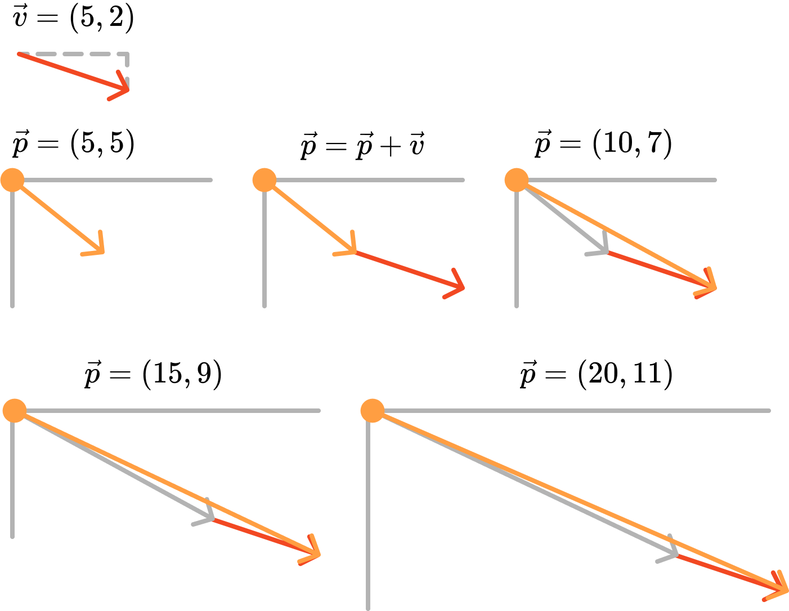

# Vetores

**Vetores** são muito utilizados em simulações e representam, neste material, uma das formas mais básicas da representação da física: uma esfera cai no chão, um planeta gira ao redor do sol etc. Vetores são fundamentais para a representação de movimentação, como uma alternativa mais adequada ao que utilizamos até o momento.

O **vetor Euclidiano** (ou **vetor geométrico**) é o tipo de vetor que estamos interessados. Ele representa uma entidade matemática que tem **magnitude** e **direção**. Geralmente, um vetor é desenhado como uma **seta**. Assim, a direção do vetor indica para onde ele está apontando e sua magnitude representa o comprimento da seta. Além disso, costumamos indicar que um vetor parte de um ponto `A` e vai até um ponto `B`.

Matematicamente, um vetor $\vec{v}$ é representado por $\vec{v}=(v_1, v_2)$ onde $v_1$ e $v_2$ são as componentes do vetor, associadas às coordenadas do sistema de coordenadas. Uma notação alternativa é utilizar $\mathbf{{v}}$ ao invés de $\vec{v}$. A figura a seguir ilustra a representação do vetor $\vec{v}$.

<figure markdown="span">
     {width="300"}
     <figcaption>Vetor Euclideano</figcaption>
</figure>

!!! note "Representações alternativas de vetores"

    Você também pode encontrar o vetor sendo representado como $\vec{v}=(v_x, v_y)$, associando-se diretamente às coordenadas do sistema de coordenadas. A quantidade de dimensões do vetor está diretamente relacionada à quantidade das suas componentes.

A magnitude, ou **norma** do vetor, é dada pela equação a seguir.

$$
\Vert\vec{v}\Vert = \sqrt{v_1^2 + v_2^2}
$$

A figura a seguir ilustra essa estrutura do vetor utilizando uma representação alternativa.

<figure markdown="span">
     {width="350"}
     <figcaption>Norma ou magnitude do vetor</figcaption>
</figure>

Perceba que a norma é calculada utilizando o teorema de Pitágoras: a hipotenusa ($h$) é igual à raiz quadrada da soma dos catetos ($a$ e $b$) ou o quadrado da hipotenusa é igual à soma dos quadrados dos catetos.


## Bola quicando -- sem vetores

O sketch a seguir demonstra como simular uma bola em movimento dentro de uma caixa. A bola bate em uma das extremidades da caixa e então move-se na direção oposta.

<div class="example-player"
     data-example-title="Bouncing Ball Without Vectors"
     data-example-path="{{ config.site_url }}/examples/synthesis/11-vectors-bouncing-no-vectors"
     data-height="400"
     data-width="400"
     data-p5-editor="https://editor.p5js.org/jacksongomes/sketches/uR8CBJVUU">
</div>

O sketch implementa a simulação do movimento da bola utilizando duas propriedades importantes:

* posição (centro da bola): variáveis `cx` e `cy`
* velocidade: variáveis `vx` e `vy`

Quando ocorre colisão, a velocidade muda de sinal:

* se `cx > width || cx < 0` então usa `-vx`
* se `cy > height || cy < 0` então usa `-vy`

Em um cenário mais elaborado, outras propriedades poderiam ser simuladas, como aceleração, vento e fricção.

Para cada conceito do mundo da simulação (vento, aceleração, fricção) há duas variáveis, uma para cada coordenada, pois o mundo é 2D. Em um mundo 3D, teríamos três variáveis e assim por diante. E se pudéssemos reduzir essas variáveis ou representá-las de outra forma?


## Vetores na p5.js

Pense em um vetor como a diferença entre dois pontos, ou instruções para caminhar de um ponto para outro.

<figure markdown="span">
     {width="500"}
     <figcaption>Vetores em computação gráfica e na p5.js</figcaption>
</figure>

Os vetores da figura podem significar:

* `(+3. +5)`: caminhe três passos para o (l)este, depois cinco passos para o note.
* `(-3, +5)`: caminhe três passos para o oeste, depois cinco passos para o norte
* `(10, -5)`: caminhe dez passos para o (l)este, depois cinco passos para o sul.

Revisitando a programação de movimento, você viu que cada frame da animação permite mudar a posição do objeto, avançando uma certa quantidade de pixels. Essa instrução "vá para a nova posição" é, essencialmente, um vetor, ela tem magnitude (qual a distância da mudança de posição?) e direção (para onde?).

<figure markdown="span">
     {width="500"}
     <figcaption>Posição e velocidade</figcaption>
</figure>

O vetor determina a **velocidade** de um objeto, definida como a razão da mudança da posição do objeto em relação ao tempo, ou seja, determina para onde vai o objeto em cada frame da animação. Isso representa nossa noção mais básica da animação de movimento: *a nova posição é igual ao resultado de aplicar velocidade à posição atual*.

Na computação gráfica, vetores partem sempre da origem, `(0,0)` em um plano 2D. Assim, não precisamos representar o vetor como tendo dois pontos, mas apenas um ponto. A magnitude será obtida a partir da distância do ponto do vetor à origem do sistema de coordenadas.

Em p5.js a classe `p5.Vector` e a função `createVector(x,y)` permitem criar vetores. Exemplos:

```javascript
let position = createVector(100, 100);
let velocity = createVector(1, 3.3);
```

Mas isso é apenas a representação do vetor. Para representar movimento, precisamos atualizar a posição atual. Na prática, seria fazer isso:

```
position = position + velocity;
```

Entretanto, na p5.js não podemos fazer isso. Então, vamos aprender melhor sobre soma de vetores.


## Adição de vetores

Matematicamente, podemos representar adição de vetores de duas formas:

* somar o vetores $\vec{u}$ e $\vec{v}$, resultando no vetor $\vec{w} = \vec{u} + \vec{v}$
* somar o vetor $\vec{v}$ e o escalar $x$, resultando no vetor $\vec{w} = \vec{v} + x$

Exemplos: para $\vec{u} = (5, 2)$ e $\vec{v} = (3, 4)$ e $x = 2$, temos:

* $\vec{w} = \vec{u} + \vec{v} = (5, 2) + (3, 4) = (8, 6)$
* $\vec{w} = \vec{u} + x = (5, 2) + 2 = (7, 4)$
* $\vec{w} = \vec{v} + x = (3, 4) + 2 = (5, 6)$

Em outras palavras, podemos criar o vetor $\vec{w} = \vec{u} + \vec{v}$ resultante das somas das componentes dos vetores:

$$
\begin{align}
     w_1 &= u_1 + v_1 \\
     w_2 &= u_2 + v_2
\end{align}
$$

A figura a seguir ilustra esse processo.

<figure markdown="span">
     {width="500"}
     <figcaption>Adição de vetores</figcaption>
</figure>

Perceba um aspecto importante da adição de vetores: a adição dos vetores $\vec{u}$ e $\vec{v}$ pode ser representada pelo reposicionamento da origem do vetor $\vec{v}$ na própria coordenada do vetor $\vec{u}$.

Na p5.js podemos representar a adição acessando as componentes dos vetores.

```javascript
position.x = position.x + velocity.x;
position.y = position.y + velocity.y;
```

Ainda, outra forma é utilizar o método `add()`:

```javascript
position.add(velocity);
```

O sketch a seguir implementa a movimentação da bola utilizando vetores para posição e velocidade.


<div class="example-player"
     data-example-title="Bouncing Ball With Vectors"
     data-example-path="{{ config.site_url }}/examples/synthesis/12-vectors-bouncing-ball"
     data-height="400"
     data-width="400"
     data-p5-editor="https://editor.p5js.org/jacksongomes/sketches/TUCbXobFK">
</div>

A seguir, um trecho do sketch mostra a criação e a atualização dos vetores na função `draw()`.

```javascript
let position; // posição
let speed; // velocidade

function draw() {
  background(220);

  // define posição futura 
  let x = position.x + speed.x;
  let y = position.y + speed.y;

  // checa colisão e altera velocidade, se for o caso
  if (x + r > width || x - r < 0) {
    speed.x = -speed.x;
  }
  if (y + r > height || y - r < 0) {
    speed.y = -speed.y;
  }

  // atualiza posição
  position.x = x;
  position.y = y;

  // Desenha a bola
  drawBall(position.x, position.y, d);
}
```

Perceba que a adição de vetores é tratada da forma como vimos anteriormente, ou seja:

```javascript
position.x = position.x + speed.x;
position.y = position.y + speed.y;
```

A figura a seguir ilustra as mudanças de posição a partir das adições sucessivas.


<figure markdown="span">
     {width="500"}
     <figcaption>Mudanças de posição após sucessivas adições de vetores</figcaption>
</figure>


A figura mostra que o vetor $\vec{p}$ é alterado sequencialmente a partir de adições com o vetor $\vec{v}$, representando a animação de movimentação do desenho associado à posição. Note, por fim, que o vetor $\vec{p}$ sempre parte da origem, independemtente das adições com o vetor $\vec{v}$.


## Outras operações com vetores

Além da adição de vetores, outras operações permitem definir uma aritmética de vetores.

A subtração de vetores, representada por $\vec{w} = \vec{u} - \vec{v}$ pode ser obtida na p5.js pelo método `sub()` ou pelo método `p5.Vector.sub()`.

Utilizando conceitos da álgebra, podemos afirmar que as igualdades são verdadeiras:

$$
\begin{align}
     \vec{w} &= \vec{u} - \vec{v} \\
     \vec{w} &= \vec{u} + -\vec{v}
\end{align}
$$

Ou seja:

1. é possível representar $\vec{v}$ de forma negativa, invertendo o sinal das suas componentes. Então $-\vec{v} = (-v_1, -v_2)$
2. a subtração é equivalente à adição entre um vetor positivo $\vec{u}$ e o inverso (negativo) do vetor $\vec{v}$. 

Isso faz com possamos ilustrar a subtração de vetores de forma semelhante à adição, como mostra a figura a seguir.

<figure markdown="span">
     {width="500"}
     <figcaption>Esquema de subtração de vetores</figcaption>
</figure>

Veja o sketch a seguir para uma demonstração da subtração de vetores: <https://editor.p5js.org/jacksongomes/sketches/E4pOSKjxa>.

Algo interessante ocorre nesse sketch sobre onde se encontra o vetor `difference`: ele é reposicionado, ou seja, sua origem não é o `(0,0)`, mas `(position.x, position.y)`, ou seja, sua origem é o vetor `position`. Isso gera um resultado diferente do que vimos até o momento, já que todos os vetores partiam da origem do sistema de coordenadas.
