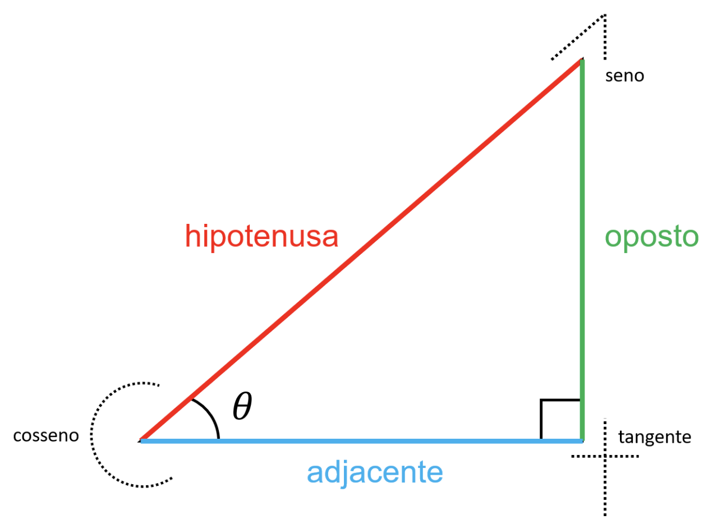
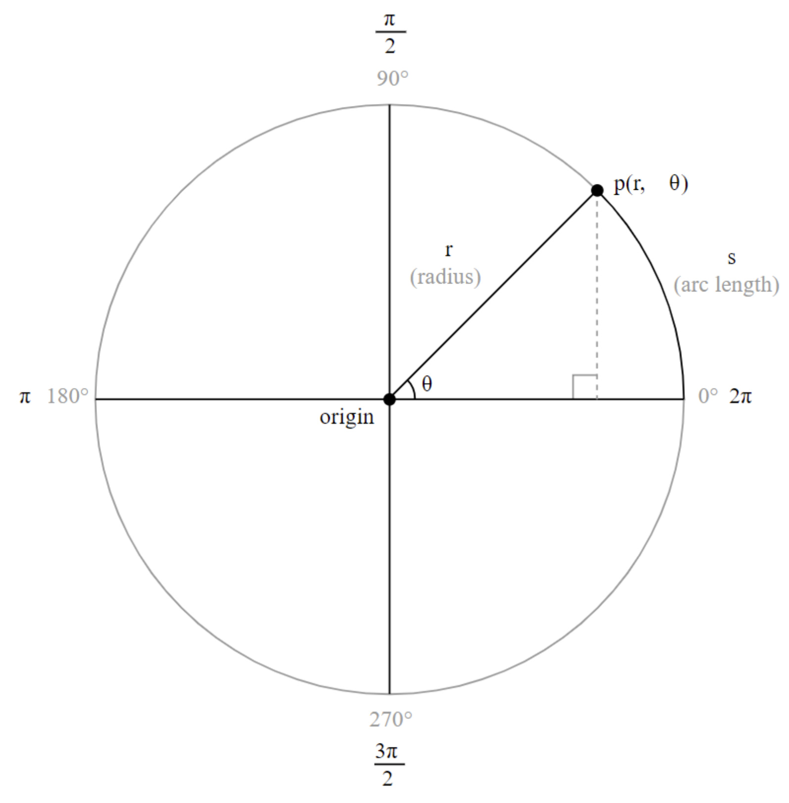

# Trigonometria

**Trigonometria** é um assunto central em Computação Gráfica. Este capítulo apresenta coisas novas ou te ajuda a lembrar de conceitos importantes. Para começar, veja o diagrama a seguir.

<figure markdown="span">
     {width="400"}
     <figcaption>Dispositivo soh-cah-toa</figcaption>
</figure>

A figura apresenta o dispositivo **soh-cah-toa**:

* **soh**: "seno igual a oposto sobre hipotenusa" (do inglês *sine opposite hipotenuse*)
* **cah**: "cosseno igual a adjacente sobre hipotenusa" (do inglês *cosine adjacent hypotenuse*)
* **toa**: "tangente igual a oposto sobre adjacente" (do inglês *tangent opposite adjacent*)

Em termos matemáticos, temos as definições:

$$
\begin{split}
    \sin \theta &= \frac{\mathrm{oposto}}{\mathrm{hipotenusa}} \\ \\
    \cos \theta &= \frac{\mathrm{adjacente}}{\mathrm{hipotenusa}} \\ \\
    \tan \theta &= \frac{\mathrm{oposto}}{\mathrm{adjacente}} \\ \\
    \tan \theta &= \frac{\sin \theta}{\cos \theta}
\end{split}
$$

Outro modelo para representar essa informação é chamado de **círculo unitário** e é ilustrado pela figura a seguir.

<figure markdown="span">
     {width="500"}
     <figcaption>Círculo unitário</figcaption>
</figure>

O círculo unitário tem rario $r=1$. Neste caso, não é utilizado o sistema de coordenadas cartesianas (SCC), mas o **sistema de coordenadas polares** (SCP) no qual uma coordenada é definida por $(r, \theta)$ ao invés de $(x,y)$, como ocorre no SCC. Aqui:

* $r$ é o raio
* $\theta$ é o ângulo de rotação

O início do sistema de coordenadas ($\theta=0$) está localizado do lado direito, na posição semelhante às 3 horas em um relógio e cresce no sentido anti-horário.

No diagrama da figura do círculo unitário o ponto $p(r,\theta)$ está localizado no grau $\frac{\pi}{4}$ (em radianos) ou $45$ (em graus). Perceba também os pontos de destaque:

* $\frac{1}{4}$ da circunferência está localizado em $\frac{\pi}{2}$
* $\frac{1}{2}$ da circunferência está localizado em $\pi$
* $\frac{3}{2}$ da circunferência está localizado em $\frac{3\pi}{2}$

No SCP os ângulos são medidos em radianos ao invés de graus. O comprimento do arco formado por $s$ é obtido por $r \times \theta$.

É possível estabelecer relações entre as funções trigonométricas e o círculo unitário. Note que há um triângulo interno ao círculo unitário, formado a partir do ponto $p$. O raio $r$ é a hipotenusa desse triângulo. Para transformar o ponto $p$ do SCP para o SCC podem ser utilizadas as equações a seguir:

$$
\begin{align}
    x &= \cos \theta \times r \\
    y &= \sin \theta \times r
\end{align}
$$

A p5.js fornece as funções para realizar transformações:

* `cos(a)` retorna o cosseno do ângulo `a`
* `sin(a)` retorna o seno do ângulo `a`
* `radians(a)` converte o ângulo `a` de graus para radianos

Essas transformações entre graus ($\alpha$) e radianos ($\theta$) também podem ser obtidas pelas equações:

$$
\begin{align}
    \theta &= \frac{\alpha \times r}{180} \quad \mathrm{ou} \quad 
    \theta = \frac{2 \pi \alpha}{360} \\ \\
    \alpha &= \frac{\theta \times 180}{\pi}
\end{align}
$$

